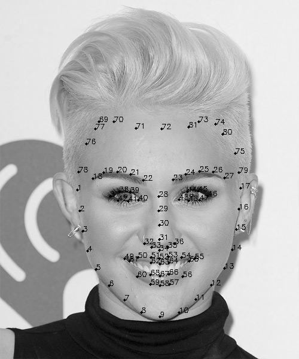

# Gender-And-Face-Shape-Recognition

This project predicts the gender and face shape of any person by taking a video input from the camera. There are two models trained and implemented for this purpose.

The first model is the Gender Prediction model saved in the file *GenderModel.p* which takes the live video input and predicts the gender of the person in the video. This model has been trained on a dataset containing the images of male and female celebrities and is available on Kaggle. For this model, Deep Learning was used by implementing CNN with the help of *keras* library and *Sequential* model and adding *Conv2D, MaxPooling2D, Activation, Flatten* and *Dense* layers.
The accuracy achieved was approximately 94 % which was evaluated by predicting gender of a test dataset.
The code on how this model was trained is in the jupyter notebook *GenderModelTraining.ipynb*.

The second model is the Face Shape Prediction model saved in *FaceShapeModel.p* which takes live video input and predicts the face shape of the person.
The dataset used for training this model had only female images and their face structures because of the unavailability of the same dataset of male images.
*Scikit-Learn's GradientBoostingClassifier* model gave the best results of about 50.2 % accuracy evaluated by testing it on a test data.
Apart from *scikit-learn*, *Dlib* was also used for facial landmark detection which detects 81 landmarks on the face by using the model in *shape_predictor_81_face_landmarks.dat* which was developed by codeniko and its repository is available on github.
The code on how this model was trained is in the jupyter notebook *FaceShapeModelTraining.ipynb*

The image below shows the landmarks detected by the model:

